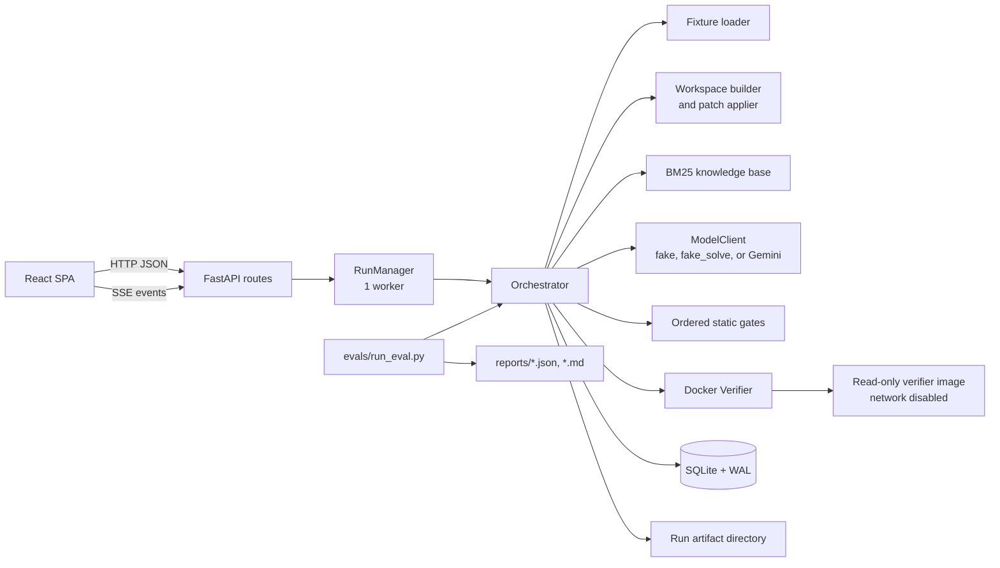

# Fixproof Architecture

## 1. Purpose and system boundary

Fixproof evaluates whether an AI-proposed code repair is a real repair. It accepts a known defect fixture, asks a model for one or more patches, filters those patches with deterministic policy gates, and reports a fix only after the target application's own tests pass in an isolated container.

The repository contains four cooperating products:

- **Fixproof backend**: FastAPI API, run queue, orchestration state machine, model clients, policy gates, verifier, persistence, and reporting.
- **Fixproof frontend**: React single-page application that visualizes defects, pipeline stages, live runs, candidates, reports, and known limits.
- **Target application**: A small pure-Python library under `target_app/` with its own tests. It is the program being repaired, not the service implementation.
- **Evaluation and verifier tooling**: Fixture validation, Docker image construction, in-container test execution, and dev/holdout evaluation.

The system intentionally does not accept arbitrary repository uploads, resume interrupted runs, or verify candidates concurrently.

## At a glance

| Concern | Owning boundary |
|---|---|
| HTTP and live progress | FastAPI routes and `RunManager` |
| Repair decision | `Orchestrator`, gates, verifier, and selection |
| Candidate context | BM25 knowledge base and model client |
| Durable history | SQLite store and run artifacts |
| User experience | React SPA and typed API client |
| Benchmark integrity | Fixtures, Docker runner, and evaluation gate |

## 2. High-level flow



The authoritative pipeline is:

```text
prepare -> baseline -> retrieve -> propose -> gate -> verify -> select
```

The backend exposes the same stage list through `/graph`, allowing the frontend to render the actual state machine rather than duplicating a separate diagram.

## Request lifecycle

1. The browser loads health, defects, reports, and the stage graph from the same-origin API.
2. A user submits a defect ID to `POST /runs`; the API validates the fixture and returns HTTP 202 with a run ID.
3. `RunManager` places the run in its FIFO queue and emits queued/running events.
4. `Orchestrator` owns all repair stages and emits stage and candidate events as work completes.
5. The browser follows live runs through SSE and refreshes the durable run view after completion.
6. The final record is written to SQLite and the artifact directory, so later reads do not depend on the worker thread.

## 3. Backend components

### Application and configuration

- `backend/app/main.py` creates the FastAPI application, configures logging, creates `Store` and `RunManager`, mounts the built frontend, and defines the application lifespan shutdown.
- `backend/app/config.py` loads environment-backed `Settings` with Pydantic validation. Relative database and artifact paths resolve from the repository root.
- `APP_MODE=demo` disables mutations with HTTP 403 responses. `MODEL_MODE=fake` is offline and deliberately produces rejectable candidates; `fake_solve` uses fixture answer keys for demonstrations and is not a measurement; `gemini` is the real model integration.
- `backend/app/fingerprint.py` produces a configuration hash for reproducibility. The hash is stored with each run and evaluation report.

The important operating modes are:

| Mode | Model | Mutations | Intended use |
|---|---|---:|---|
| `local` + `fake` | Deterministic rejectable client | Enabled | Harness and safety checks |
| `local` + `fake_solve` | Fixture reference patch | Enabled | Explicit happy-path demonstration |
| `local` + `gemini` | Configured Gemini model | Enabled | Model evaluation |
| `demo` + `fake` | Recorded/read-only experience | Disabled | Public demonstration |

Configuration validation rejects missing Gemini credentials and rejects combining demo mode with a real model key.

### API and scheduling

- `backend/app/api/routes.py` defines health, defect, run, artifact, report, graph, decision, and status endpoints.
- `backend/app/api/runner.py` owns active run handles and the ordered queue. A `ThreadPoolExecutor(max_workers=1)` ensures that Docker verification is serialized. Queued runs expose their position.
- Run progress is streamed as Server-Sent Events from `/runs/{run_id}/events`. Events include status changes, stage transitions, candidate results, errors, and completion.
- Completed runs are reconstructed from SQLite. A live run remains available through its in-memory handle while its final record is persisted.

### Domain model

`backend/app/models/domain.py` is the typed boundary between pipeline stages. Important types are:

- `Defect`: immutable fixture metadata, including failing pytest node and `allowed_paths`.
- `ProposedPatch`: model output parsed as a unified diff. Touched paths and changed-line counts are derived from the diff, never trusted from the model.
- `CandidateOutcome`: candidate, gate results, optional verification, and status.
- `VerificationResult`: target-test result, full-suite outcomes, regressions, timeout, and container metadata.
- `RunRecord`: final run decision, timings, usage, candidates, and artifact location.

A candidate is eligible only when its target test passes, it has no regressions against the baseline, and it did not time out.

## 4. Run lifecycle

### 4.1 Prepare

`fixtures.py` loads `defect.json` and the fixture's `break.patch`. `workspace.py` copies `target_app/` into a run-specific artifact workspace and applies the break patch. The reference patch is kept behind a separate method and is not included in model prompt construction.

The run writes `defect.json` and later stage artifacts below `runtime/runs/<run_id>/`.

### 4.2 Baseline

The broken workspace is sent to the verifier before any candidate is applied. The verifier runs the named failing test and then the complete target suite. The set of tests that passed in this baseline becomes the comparison set for regression detection.

This makes "no regressions" a computed property instead of a model claim.

### 4.3 Retrieve

`retrieval.py` indexes `knowledge/chunks.jsonl` with deterministic BM25 ranking. The query combines the defect summary, category, failing test, allowed paths, failing-test source, and baseline assertion output.

The top-k ranked chunks are supplemented with forced inclusions for the failing test and allowed source files. A token budget removes lower-scoring optional chunks first. Retrieval records both the final context and the unmodified ranked list so `recall_at_8` is not inflated by forced inclusions.

### 4.4 Propose

`model_client.py` builds a constrained prompt and requests up to `MAX_CANDIDATES` patches. The client protocol supports:

- `FakeModelClient`: deterministic no-op, out-of-scope, and test-editing patches used to exercise the harness.
- `FakeSolveModelClient`: fixture reference patches for an explicitly stamped happy-path demonstration.
- Gemini client: JSON-schema constrained model output with retry handling for transient provider failures, quota distinctions, usage tracking, and optional pricing.

Multiple proposal rounds are possible. If no candidate is verified, feedback from gate failures, test failures, regressions, and timeouts is supplied to the next round until the round or whole-run budget is exhausted.

### 4.5 Gate

`gates.py` evaluates candidates in order and stops at the first rejection:

1. `diff_parses`
2. `scope`
3. `no_test_edits`
4. `no_new_or_deleted_files`
5. `size`
6. `syntax`
7. `lint`
8. `no_new_imports`
9. `no_dangerous_calls`

The first five gates operate on the diff alone. A workspace is created only for candidates that pass them. The remaining gates compare patched files against their broken baseline, so inherited lint or import problems do not invalidate a repair unless the candidate introduces them.

The test-edit gate is intentionally separate from the generic scope gate. Test modifications are counted as an explicit honesty metric, and no test edit can proceed to verification.

### 4.6 Verify

For every candidate that survives the gates, `workspace.py` creates a fresh copy of the broken workspace, applies the candidate with Git, and confirms that the actual touched paths match the parsed diff.

`verifier.py` then:

- creates a temporary Docker volume;
- creates a container with no network, read-only root filesystem, memory/CPU/PID limits, and a writable temporary filesystem;
- copies the candidate snapshot into `/work`;
- runs the image entrypoint;
- kills the container from the host if the verifier timeout expires;
- always removes the container and volume in `finally` cleanup.

The image built by `docker/verifier.Dockerfile` contains Python 3.12, target dependencies, verifier dependencies, and `docker/run_tests.py`. The runner executes the named test and then the complete suite, returning one JSON document. Pytest failures are result data; runner failures are reported separately.

### 4.7 Select

`selection.py` first filters to eligible verification results. It then chooses deterministically by:

1. fewest changed lines;
2. fewest touched files;
3. highest model confidence;
4. earliest round;
5. candidate ID as a final stable tie-breaker.

The resulting decision is one of `FIX_VERIFIED`, `NO_VERIFIED_FIX`, `ALL_GATED`, `TIMEOUT`, or `ERROR`.

### State transitions

At run level, a request moves through `queued -> running -> succeeded` when the orchestrator completes normally. A failed stage moves the run to `failed`; cooperative cancellation moves it to `cancelled`. The decision is independent detail recorded on the terminal run: for example, a normally completed run may have `ALL_GATED` or `NO_VERIFIED_FIX` without being an infrastructure failure.

Candidate status follows the evidence available for that candidate: it starts as `proposed`, becomes `rejected` when a gate fails, becomes `verified` after a successful container check, and can become `errored` when candidate processing cannot complete. This separation lets the UI explain both the run's operational state and the repair decision.

## 5. Persistence and artifacts

### SQLite

`backend/app/services/store.py` uses plain `sqlite3`, foreign keys, and WAL mode. The schema is in `backend/app/services/schema.sql` and contains:

- `runs`: run state, decision, model/config identity, timings, timestamps, and artifact directory;
- `candidates`: proposed diffs and derived metadata;
- `gate_results`: ordered gate outcomes and details;
- `verifications`: container/test outcomes and regression lists;
- `usage`: model calls, tokens, pricing, and whether cost is known;
- `schema_version` plus indexes for run and gate queries.

A run is saved as one logical record with child candidate, gate, verification, and usage rows. Foreign-key cascades remove child rows when a run is replaced or deleted.

### Run artifacts

Each run writes inspectable files under `runtime/runs/<run_id>/`, including `defect.json`, `baseline.json`, `retrieval.json`, `run.json`, `report.md`, `report.json`, and candidate-level prompts, raw responses, applied patches, gate results, verification JSON, stdout, and errors. The API exposes only a fixed allow-list of top-level artifact names; client paths are never joined directly.

Evaluation reports under `reports/` are generated by `evals/run_eval.py` and are served by `/reports` and `/reports/latest`.

Typical run artifacts have this shape:

```text
runtime/runs/<run_id>/
    defect.json
    baseline.json
    retrieval.json
    run.json
    report.json
    report.md
    candidates/<candidate_id>/
        prompt.txt
        response.raw.json
        gates.json
        applied.patch
        apply.log
        verification.json
        stdout.txt
```

The candidate workspace snapshots are disposable implementation details; the JSON, text, and patch files are the inspection boundary intended for operators and the API.

## 6. HTTP contract

| Endpoint | Purpose |
|---|---|
| `GET /healthz` | Runtime health, Docker/image state, schema version, mode, and config hash |
| `GET /defects` and `GET /defects/{id}` | List or inspect fixture metadata without exposing reference patches |
| `POST /runs` | Queue a run; returns HTTP 202 and queue position |
| `GET /runs` and `GET /runs/{id}` | List summaries or retrieve complete run details |
| `GET /runs/{id}/events` | Stream live stage and candidate events with SSE |
| `POST /runs/{id}/cancel` | Request cooperative cancellation |
| `GET /runs/{id}/artifacts/{name}` | Read an allow-listed artifact |
| `GET /reports`, `GET /reports/latest` | Read committed evaluation reports |
| `GET /graph` | Return the backend stage graph used by the UI |
| `GET /decisions`, `GET /statuses` | Return displayable enum explanations |

In demo mode, mutating endpoints remain real routes and return 403, making the deployment's read-only behavior explicit rather than disguising it as missing functionality.

### Error and availability semantics

- `404` means the requested defect, run, artifact, report, or API path does not exist.
- `403` means the route exists but a demo deployment intentionally refuses a mutation.
- `409` on an event stream means the run was completed by an earlier process and must be read through `/runs/{id}` instead.
- `202` means a run was accepted into the single-worker queue, not that a repair was found.
- `/healthz` reports Docker reachability, image presence, leaked containers, and mutation availability so operators can distinguish a healthy read-only deployment from a verifier-ready local one.

## 7. Frontend architecture

`frontend/src/main.tsx` mounts the React application under `QueryClientProvider`. `App.tsx` composes the page sections and the read-only notice. TanStack Query hooks in `frontend/src/lib/` fetch health, defects, reports, graph data, and run state. `useRun.ts` combines polling with the SSE event stream for active runs.

The page is split into focused sections:

- `Hero`: product identity and entry into the interactive area;
- `HowItWorks`: pipeline visualization;
- `TheCatch`: test-edit and honesty contract;
- `Live`: defect selection, run creation, queue/progress state, and candidate details;
- `Results`: evaluation report and metrics;
- `Limits`: explicit scope and limitations;
- `Footer`: supporting links and project metadata.

`frontend/src/api.ts` is the typed client contract. Production FastAPI serves `frontend/dist` from the same origin, while Vite provides the development workflow. The backend SPA fallback derives known API roots from the router so an unknown API path remains a 404 instead of being swallowed by the frontend fallback.

Frontend data ownership is intentionally split: TanStack Query owns request caching and refetching, `useRun.ts` owns active-run polling/SSE coordination, and the section components own presentation. No frontend component reimplements candidate eligibility or stage ordering; those values come from the backend response and `/graph`.

## 8. Fixtures, target application, and evaluation

Each fixture directory under `fixtures/dev/` or `fixtures/holdout/` contains:

- `defect.json`: category, difficulty, failing test, summary, and editable scope;
- `break.patch`: the seeded defect;
- `reference.patch`: the known correct repair, used only by validation/scoring and `fake_solve`;
- `notes.md`: fixture notes.

`scripts/validate_fixtures.py` proves that the clean target suite is green, the break patch fails exactly the named test with no collateral failures, the reference patch restores green, both patches stay within scope, and the defect metadata does not leak the answer.

`evals/run_eval.py` runs a fixture set, aggregates decisions and safety metrics, and applies a mechanism-focused quality gate. It records model mode, model name, config hash, test-edit attempts, accepted test edits, regression rate, gate rejection rates, retrieval recall, latency, usage, cost availability, and leaked-container checks. Development fixtures may be iterated on; holdout fixtures are intended for frozen-config evaluation.

### Validation layers

| Layer | Command or entrypoint | Verifies |
|---|---|---|
| Unit/API | `pytest backend/tests` | Service contracts, gates, persistence, and routes |
| Verifier | `pytest verifier/tests -m docker` | Container isolation and cleanup |
| Fixtures | `scripts/validate_fixtures.py --set <set>` | Seeded bug and answer-key integrity |
| Evaluation | `evals/run_eval.py --set <set> --gate` | Aggregate safety and quality thresholds |
| Browser | `frontend/npx playwright test` | User journey and rendered frontend behavior |

These layers are complementary: unit tests do not prove Docker isolation, and a green fixture validator does not prove the model-facing API or browser workflow.

## 9. Security and trust boundaries

The model is untrusted input. Its prompt rules are advisory; the gates, patch applier, and verifier enforce the actual policy.

The main protections are:

- fixture-declared editable paths;
- unified-diff parsing and Git apply checks;
- refusal of test edits, file creation/deletion/rename, mode changes, binary hunks, dangerous calls, and new imports;
- fresh per-candidate workspaces;
- no network and read-only container root;
- host-enforced container timeout and resource limits;
- allow-listed artifact names;
- no reference patch in model retrieval context;
- explicit configuration and model identity hashes in stored records.

This is a controlled repair harness, not a general-purpose sandbox for arbitrary hostile repositories. The target program and fixture corpus are repository-owned and intentionally small.

## 10. Operational model and known limits

- Docker is required for verification. Without the verifier image, health reports the missing capability and runs fail safely.
- Runs are serialized because Docker is treated as a shared resource; there is no parallel candidate verification.
- SQLite is appropriate for one service process and a small number of readers. A multi-writer or multi-consumer deployment would require a different persistence boundary.
- The retrieval system is lexical BM25 with no embeddings or reranker. `recall_at_8` is the signal for when that tradeoff stops being adequate.
- The target application is a compact, pure-Python benchmark. Results do not establish performance on arbitrary production repositories.
- Interrupted runs are not resumed. A new run starts from a clean fixture snapshot, which keeps decisions reproducible and avoids ambiguous half-applied state.

## 11. Important extension points

- Add a model provider by implementing the `ModelClient` protocol and selecting it in `build_model_client`.
- Add a policy rule by extending the ordered gates and its `GateResult` representation; preserve short-circuit ordering when the rule can reject before workspace creation.
- Change verification behavior in `Verifier` and `docker/run_tests.py` together so host interpretation remains aligned with the container protocol.
- Add a fixture category by extending the domain literal, fixture metadata, target tests, and validation/evaluation corpus.
- Add API/UI data by updating the Pydantic response model, `frontend/src/api.ts`, and the consuming React hook or section as one contract change.
